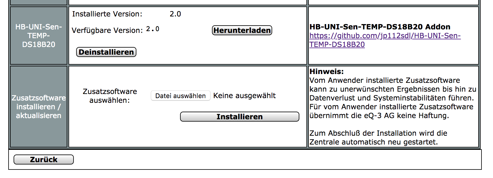
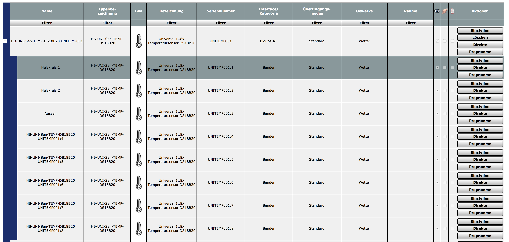
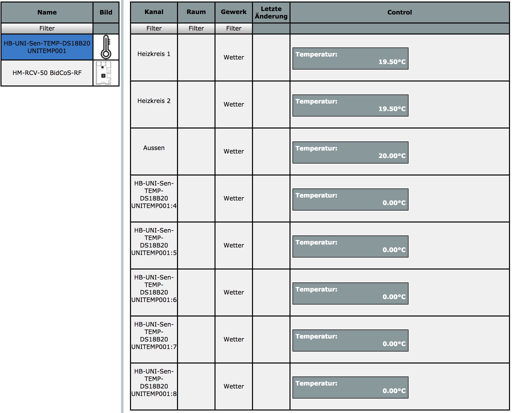

# HB-UNI-Sen-TEMP-DS18B20
## Funk "8fach Universal-Temperatursensor" für die Integration in HomeMatic

## benötigte Hardware
* 1x Arduino Pro Mini **(3.3V / 8MHz)**
* 1x CC1101 Funkmodul **(868 MHz)**
* 1x FTDI Adapter (wird nur zum Flashen benötigt)
* 1x Taster (beliebig... irgendwas, das beim Draufdrücken schließt :smiley:)
* 1x LED 
* 1x Widerstand 330 Ohm
* 1x Widerstand 4,7 kOhm
* 1x ... 8x DS18B20 Temperatursensor(en)
* Draht, um die Komponenten zu verbinden

Um die Batterielebensdauer zu erhöhen, ist es unbedingt notwendig, die grüne LED vom Arduino Pro Mini mit einem kleinen Schraubendreher oder Messer von der Platine zu entfernen!

## Code flashen
Beide Dateien aus dem [Ordner](https://github.com/jp112sdl/HB-UNI-Sen-TEMP-DS18B20/tree/master/HB-UNI-Sen-TEMP-DS18B20) herunterladen und gemeinsam in einem Ordner speichern.
Arduino IDE öffnen, entsprechendes Werkzeuge->Board: "Arduino Pro or Pro Mini" sowie Prozessor: (ATmega328P (3.3V 8MHz) auswählen und Port: entsprechend einstellen.

Im Menü "Sketch" -> "Hochladen" auswählen.

## Addon installieren
In der CCU2 (oder RaspberryMatic) muss vor dem Anlernen noch ein Addon installiert werden. 
Die .tgz kann [hier](https://github.com/jp112sdl/HB-UNI-Sen-TEMP-DS18B20/raw/master/Addon/HB-UNI-Sen-TEMP-DS18B20-addon.tgz) heruntergeladen werden. 
Die Datei darf nicht entpackt werden! 
Über "Einstellungen"->"Systemsteuerung"->"Zusatzsoftware" wählt man die Datei aus und klickt auf "Installieren".
Die CCU2 startet automatisch neu. 
**Achtung: Nachdem das System wieder hochgefahren ist, muss noch einmal ein Neustart erfolgen!** 
**"Einstellungen"->"Systemsteuerung"->"Zentralenwartung", Button "Neustart"** 
Nun ist das Addon einsatzbereit. 

## Gerät anlernen
Wenn alles korrekt verkabelt und das Addons installiert ist, kann das Gerät angelernt werden. 
Über den Button "Gerät anlernen" in der WebUI öffnet sich der Anlerndialog. 
Button "HM Gerät anlernen" startet den Anlernmodus. 
Nun ist der Taster (an Pin D8) kurz zu drücken. 
Die LED leuchtet für einen Moment. 
Anschließend ist das Gerät im Posteingang zu finden. 
Dort auf "Fertig" geklickt, wird es nun in der Geräteübersicht aufgeführt. 

  
Unter "Status und Bedienung" -> "Geräte" können die einzelnen Werte angezeigt werden. 

Eine Verwendung in Programmen ist ebenfalls möglich.

